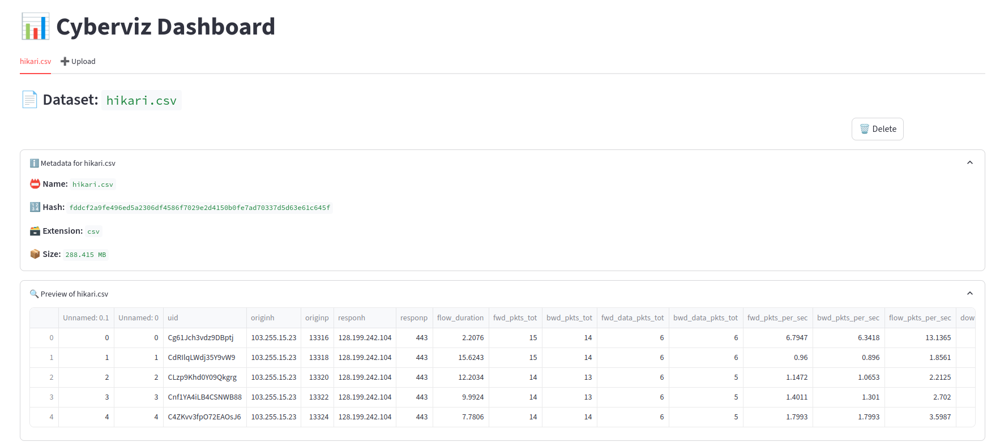
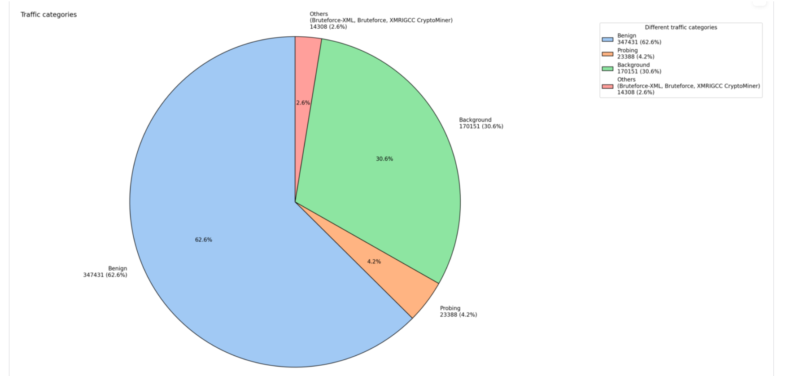

# Cyberviz

CyberViz is a framework for data visualization and manipulation of large dataset written in python.
The main purpose of the tool is to help people understanding one or several dataset correctly and perfom plenty of operation like AI training, dynamic visualization with graphs and more.

As the name suggest, this tool is oriented for cybersecurity so I'm principally developping features for security dataset like csv, pcap or logs.

Features :
- Open .csv and .pcap dataset 
- Data visualization with graphics
- Dashboard using streamling
- Detect attack patterns

# TODO 

Done :
- define a dataset and a dataset collection
- create the main class for dataset collection management (Cyberviz)
- define CSV type for load(), preview() and metadata()

Todo :
- add more methods for data viz on CSV dataset
- define PCAP type
- more type checking and tests

# Sources 

A csv dataset called Hikari :

Pie chart of the header 'traffic category' :

# Sources (update 2025) :
- IoT-23 : https://www.stratosphereips.org/blog/2020/1/22/aposemat-iot-23-a-labeled-dataset-with-malicious-and-benign-iot-network-traffic
- Hikari 2021 : https://zenodo.org/records/5199540
